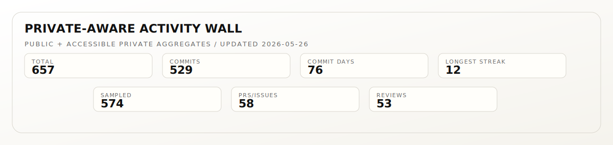
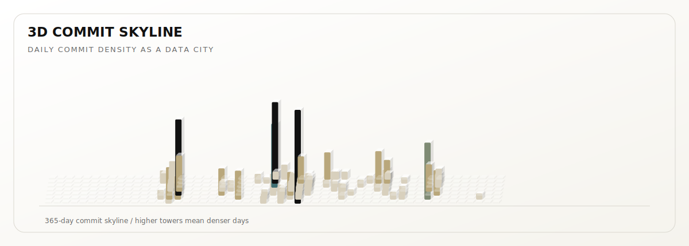
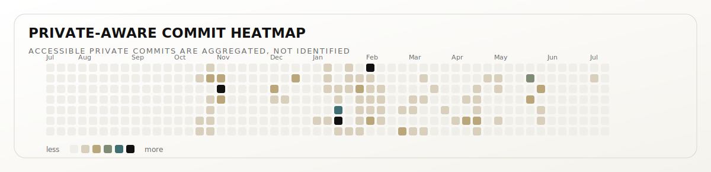
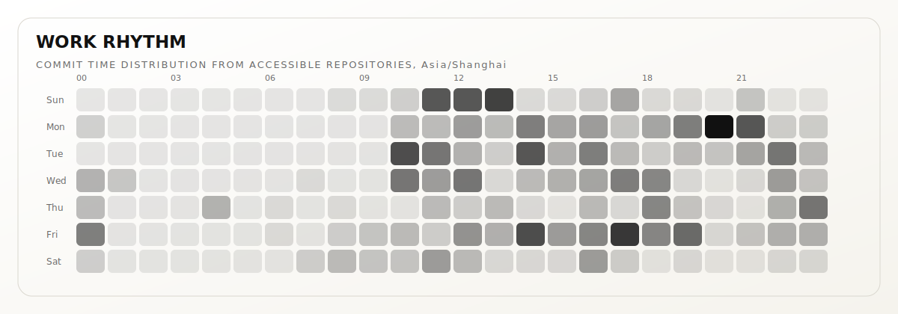
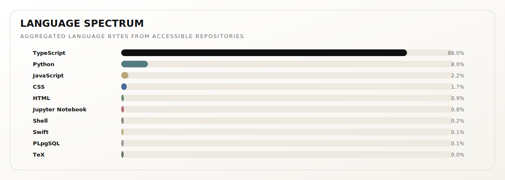

<picture>
  <source media="(prefers-color-scheme: dark)" srcset="./assets/profile/stats-strip.svg">
  
</picture>

<!--
This profile is generated by scripts/profile-metrics.mjs.
Private repository names are not published; only aggregate metrics are rendered.
Set PROFILE_STATS_TOKEN as a repository secret to include private repositories.
-->
